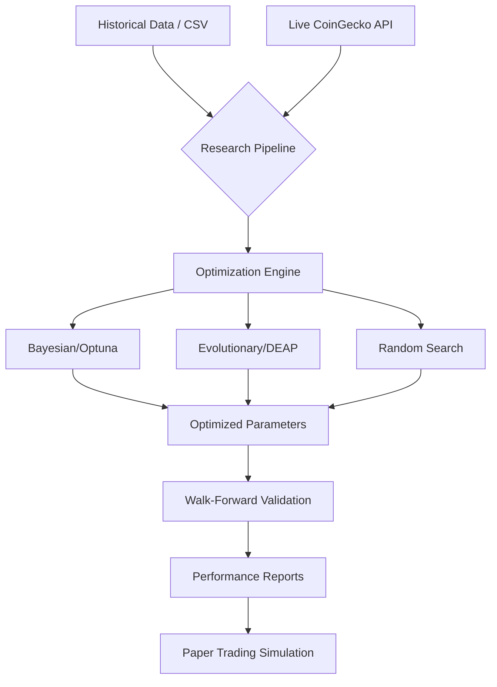

# 📈 ML & Quantitative Trading Research Platform

[](https://www.python.org/downloads/)
[](https://opensource.org/licenses/MIT)
[](https://optuna.org/)

A professional research framework designed to study the effectiveness and limitations of **machine-learning-assisted parameter optimization** applied to human-defined algorithmic trading strategies.

---

## 🎯 Core Research Philosophy

> **"ML does NOT invent new strategies; it ONLY optimizes the parameters of user-defined rules."**

This platform treats human intuition as the "Base Model" and Machine Learning as the "Fine-Tuning" layer. We focus on three critical research questions:
1. **WHEN** does ML optimization provide a statistically significant edge?
2. **HOW** does ML adapt to changing market regimes (e.g., trend vs. mean reversion)?
3. **WHEN** does ML optimization fail (overfitting, look-ahead bias, or data leakage)?

---

## ✨ Key Features

| Category | Description |
| :--- | :--- |
| **Optimization** | Bayesian (`Optuna`, `Scikit-Optimize`), Random Search, and Evolutionary Algorithms (`DEAP`). |
| **Strategies** | Built-in `RSI Mean Reversion`, `EMA Crossover`, `Bollinger Breakout`, and **Custom NLP Rules**. |
| **Validation** | Robust **Walk-Forward Validation** engine to simulate real-world parameter degradation. |
| **Hybrid Flow** | Combines historical backtesting with **Live CoinGecko Data** for near-real-time optimization. |
| **Simulation** | High-speed **Paper Trading Simulator** using WebSocket-like data streams for live validation. |
| **Auditability** | Full JSON logging of every trial for deep analysis of the optimization surface. |

---

## 🏗 System Architecture



---

## 📁 Project Structure

```text
├── analysis/         # Jupyter notebooks and research analysis tools
├── audit/            # Blockchain-anchored session logs (Optional)
├── backtesting/      # Core engine for walk-forward and historical testing
├── config/           # Pydantic-based settings and experiment configurations
├── data/             # Repository for OHLCV datasets (BTC, ETH, etc.)
├── features/         # Feature engineering and live feature updating
├── optimization/     # ML optimization adapters (Optuna, Skopt, DEAP)
├── realtime/         # WebSocket simulators and Paper Trading engine
├── strategies/       # Base strategy classes and NLP rule parser
├── hybrid_flow.py    # Logic for merging human intuition with live data
├── main.py           # Unified CLI Entry point
└── research_pipeline.py # End-to-end execution orchestrator
```

---

## 🛠 Installation

1. **Clone the repository:**
   ```bash
   git clone <repository_url>
   cd Major
   ```

2. **Setup Virtual Environment (Recommended):**
   ```bash
   python -m venv venv
   source venv/bin/activate  
   ```

3. **Install Dependencies:**
   ```bash
   pip install -r requirements.txt
   ```

---

## 🚀 Usage Guide

### 1. Standard Optimization & Backtesting
Optimize the `rsi_mean_reversion` strategy across multiple timeframes with 5-window walk-forward validation:
```bash
python main.py --data ./data/btcusdt_1m.csv --strategy rsi_mean_reversion --timeframes 5m,15m --walk-forward --wf-windows 5
```

### 2. Hybrid Human + Live Optimization
Seed the optimizer with human "intuition," pull the latest 24h data from CoinGecko, and see if ML can refine the parameters:
```bash
python main.py --data ./data/btcusdt_1m.csv --hybrid-live --symbol BTCUSDT \
  --human-param rsi_buy_threshold=30 \
  --human-param rsi_sell_threshold=70 \
  --coingecko-days 1
```

### 3. Custom Natural Language Rules
Define your own trading rules directly from the CLI using the NLP parser:
```bash
python main.py --strategy custom --algorithm "EMA20 < EMA50 AND RSI < 30" --data ./data/btcusdt_1m.csv
```

### 4. Paper Trading Simulation
Test the resulting ML-optimized parameters in a simulated live environment:
```bash
python main.py --paper-trade --symbol BTCUSDT --replay-speed 60
```

---

## 📊 Outputs & Insights

All research artifacts are stored in `./research_output/`:
- **`session_[ID].json`**: Raw data from every optimization trial.
- **`reports/report_[ID].md`**: Human-readable summaries with Sharpe, Sortino, and Drawdown analysis.
- **`audit/`**: Detailed logs for transparency and reproducibility.

---

## 📜 License

Distributed under the **MIT License**. See `LICENSE` for more information.

---
**Disclaimer:** *This is research software. Past performance is not indicative of future results. Use for live trading at your own risk.*
