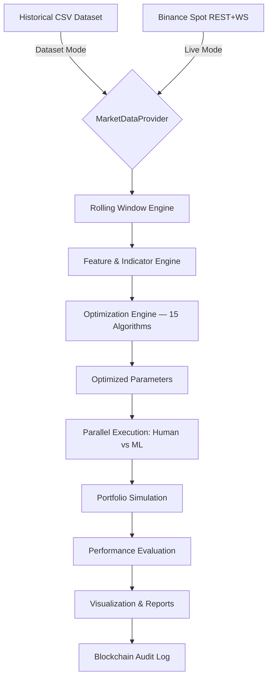

# 📈 BeyondAlgo — Explainable ML-Assisted Algorithmic Trading Framework

[](https://www.python.org/downloads/)
[](https://opensource.org/licenses/MIT)
[](https://optuna.org/)

A professional research framework designed to study the effectiveness and limitations of **machine-learning-assisted parameter optimization** applied to human-defined algorithmic trading strategies.

---

## 🎯 Core Research Philosophy

> **"ML does NOT invent new strategies; it ONLY optimizes the parameters of user-defined rules."**

This platform treats human intuition as the "Base Model" and Machine Learning as the "Fine-Tuning" layer. We focus on three critical research questions:
1. **WHEN** does ML optimization provide a statistically significant edge?
2. **HOW** does ML adapt to changing market regimes (e.g., trend vs. mean reversion)?
3. **WHEN** does ML optimization fail (overfitting, look-ahead bias, or data leakage)?

---

## ✨ Key Features

| Category | Description |
| :--- | :--- |
| **15 Optimizers** | Random/Grid/Latin Hypercube/Sobol, Bayesian GP/TPE, CMA-ES, DE, PSO, SA, GA, ES, NSGA-II/III, Hyperband+ASHA |
| **Strategies** | Built-in `RSI Mean Reversion`, `EMA Crossover`, `Bollinger Breakout`, and **Custom NLP Rules** |
| **Dual Mode** | Operates in **Dataset Replay** or **Live Binance Spot Market** mode — switch via config only |
| **Validation** | Robust **Walk-Forward Validation** engine to simulate real-world parameter degradation |
| **Market Data** | **Binance Spot Market** data via REST klines + WebSocket streaming |
| **Simulation** | High-speed **Paper Trading Simulator** using WebSocket-like data streams |
| **Regime Detection** | Automatic market regime classification (Trending, Sideways, High/Low Volatility) |
| **Blockchain Audit** | SHA-256 hashed audit logs with Merkle tree anchoring for full transparency |
| **Visualization** | Auto-generated equity curves, drawdown charts, optimizer comparisons, regime heatmaps |

---

## 🏗 System Architecture


```mermaid
graph TD
    A[Historical CSV Dataset] -->|Dataset Mode| B{MarketDataProvider}
    L[Binance Spot REST+WS] -->|Live Mode| B
    B --> C[Rolling Window Engine]
    C --> D[Feature & Indicator Engine]
    D --> E[Optimization Engine — 15 Algorithms]
    E --> F[Optimized Parameters]
    F --> G[Parallel Execution: Human vs ML]
    G --> H[Portfolio Simulation]
    H --> I[Performance Evaluation]
    I --> J[Visualization & Reports]
    J --> K[Blockchain Audit Log]
```

---

## 📁 Project Structure

```text
├── market_data/      # Unified data provider (Dataset + Binance Live)
├── pipeline/         # Autonomous ML loop and portfolio simulation
├── analysis/         # Research analysis and compatibility checks
├── audit/            # Blockchain-anchored session logs
├── backtesting/      # Walk-forward and historical testing engine
├── config/           # Unified configuration (single config file)
├── data/             # OHLCV datasets (BTC, ETH, etc.)
├── evaluation/       # Performance metrics and research reports
├── features/         # Feature engineering and regime detection
├── optimization/     # 15 ML optimization algorithms
├── realtime/         # WebSocket streaming and paper trading
├── strategies/       # Strategy definitions and NLP rule parser
├── visualization/    # Auto-generated charts and graphs
├── tests/            # Unit tests
├── main.py           # Unified CLI entry point
└── research_pipeline.py # Batch research orchestrator
```

---

## 🛠 Installation

1. **Clone the repository:**
   ```bash
   git clone <repository_url>
   cd Major
   ```

2. **Setup Virtual Environment (Recommended):**
   ```bash
   python -m venv venv
   source venv/bin/activate  
   ```

3. **Install Dependencies:**
   ```bash
   pip install -r requirements.txt
   ```

---

## 🚀 Usage Guide

### 1. Autonomous Mode (Dataset Replay)
Run the full ML pipeline loop in dataset mode — processes candles one-by-one with rolling window:
```bash
python main.py --autonomous --config-file config/beyondalgo.json
```

### 2. Autonomous Mode (Live Binance)
Switch to live Binance spot market data by changing `DATA_SOURCE` in config:
```bash
# Edit config/beyondalgo.json: set "DATA_SOURCE": "live"
python main.py --autonomous --config-file config/beyondalgo.json
```

### 3. Standard Optimization & Backtesting
Optimize strategies across timeframes with walk-forward validation:
```bash
python main.py --data ./data/raw/OHLCV_Binance_BTC-USDT_*.csv --strategy rsi_mean_reversion --walk-forward --wf-windows 5
```

### 4. Hybrid Multi-Optimizer Sweep
Run all 15 optimizers and compare results:
```bash
python main.py --data ./data/raw/OHLCV_Binance_BTC-USDT_*.csv --hybrid-live --symbol BTCUSDT \
  --human-param rsi_buy_threshold=30 --human-param rsi_sell_threshold=70
```

### 5. Custom Natural Language Rules
Define your own trading rules directly from the CLI:
```bash
python main.py --strategy custom --algorithm "EMA20 < EMA50 AND RSI < 30" --data ./data/raw/OHLCV_Binance_BTC-USDT_*.csv
```

### 6. Paper Trading Simulation
Test ML-optimized parameters in a simulated live environment:
```bash
python main.py --paper-trade --symbol BTCUSDT --replay-speed 60 --data ./data/raw/OHLCV_Binance_BTC-USDT_*.csv
```

---

## ⚙️ Configuration

All behavior is controlled via a single config file (`config/beyondalgo.json`):

```json
{
  "DATA_SOURCE": "dataset",
  "SYMBOL": "BTCUSDT",
  "TIMEFRAME": "1m",
  "WINDOW_SIZE": 500,
  "CSV_PATH": "./data/raw/OHLCV_Binance_BTC-USDT_D20170817T040000UTC-D20240404T115959UTC_1min.csv",
  "REST_ENDPOINT": "https://api.binance.com/api/v3/klines",
  "WEBSOCKET_ENDPOINT": "wss://stream.binance.com:9443/ws"
}
```

Switch from dataset to live mode by changing only `DATA_SOURCE` — no code modifications needed.

---

## 📊 Outputs & Insights

All research artifacts are stored in `./research_output/`:
- **`session_[ID].json`**: Raw data from every optimization trial
- **`reports/report_[ID].md`**: Human-readable summaries with Sharpe, Sortino, and Drawdown analysis
- **`charts/`**: Auto-generated visualizations (equity curves, regime heatmaps, convergence plots)
- **`audit/`**: Blockchain-anchored audit logs with SHA-256 hash verification

---

## 📜 License

Distributed under the **MIT License**. See `LICENSE` for more information.

---
**Disclaimer:** *This is research software. Past performance is not indicative of future results. Use for live trading at your own risk.*
